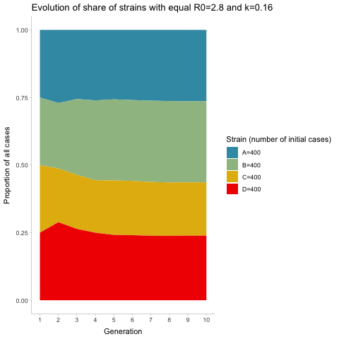

# Strain simulation

Simulation of dominance of strains using negative binomial distribution.

Each gif frame is a an individual simulation.

## 25 initial cases each:

## One strain with 50 intial cases, the rest 25

## All strains with 100 initial cases

