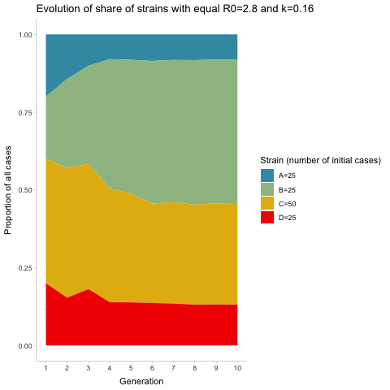

# Strain simulation

Simulation of dominance of strains using negative binomial distribution \#\# 10 initial cases each:

## One strain with 25 intial cases, the rest 10

## All strains with 100 initial cases

